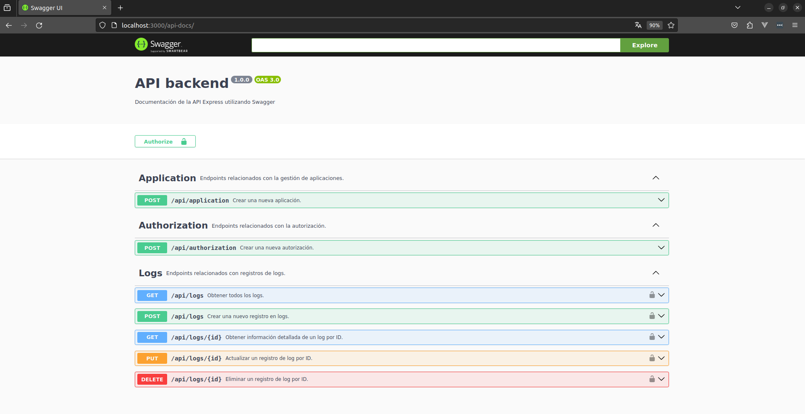

# Tendencys Innovations | Caso Prueba Técnica Vacante Desarrollador Back End


Este repositorio 

## Instalación
### Primer paso: clonar el repositorio 

```bash
git clone https://github.com/MiguelAngelMP10/e-backend-logger.git
```

### Segundo paso: moverce a la carpeta del proyecto 

```bash
 cd e-backend-logger
```

### Tercer paso: instalar las dependencias del proyecto con el siguiente comando
```bash
 npm install
```

### Cuarto paso: crear archivo .env con el siguinete comando 

```bash
    cp .env-example .env
```
Nota: configurar los valores para que se adecuen a tu entorno. de las variables globales no olvides que debes de tener instalado mongodb

```plaintext
SECRET_KEY=mySecretKey
DB_CONNECTION_STRING=mongodb://localhost:27017
PORT=3000
```
### Quinto paso: Ejecutar el siguienete comando para iniciar el servicio

```bash
    npm run start
```
### Sexto paso: para checar la funcionalidad y la documentacion de los servicios puedes checar esta url

```plaintext
   http://localhost:3000/api-docs/
```
## En la siguiente imagen se muestra docuemntado cada uno de los servicios.




# Flujo de los servicios 
 
 Primero haya que crear una nueva aplicacion 
 Segundo crear un token para la aplicacion 

 Nota: No olvidar que los servicios de logs necesitan un token.